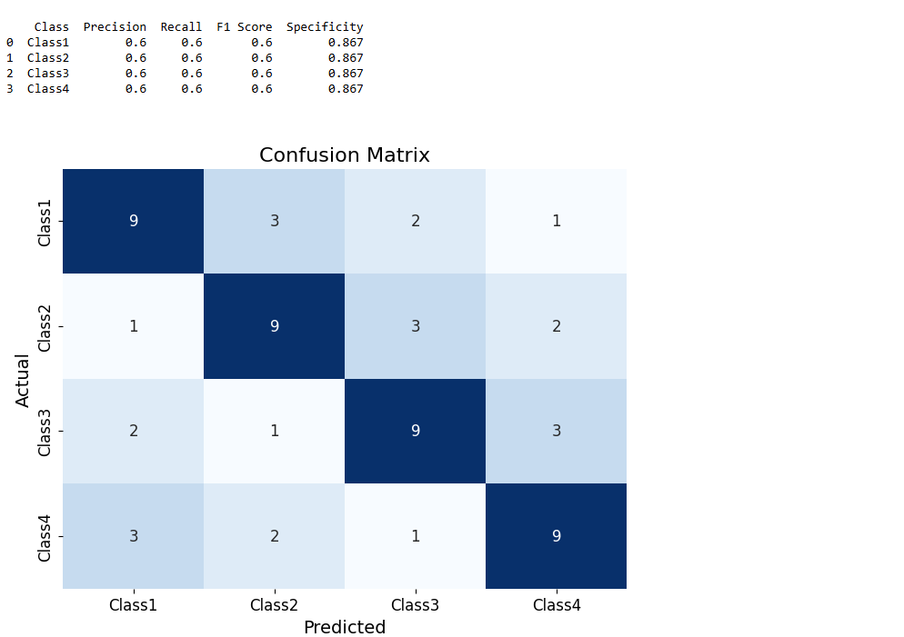

# XGBoost_to_aggretae_OVR_Classifiers
An implementation of the XGBoost classifier model for aggregation of multiple One-Vs-Rest classifiers.
In this example, each Var column may be a score or quantification from a classifier or any other measure.

## Preparing input file (CSV)
To feed the train and test sets to the XGBoost in this code, you need to make CSV files like the one below:

| Var1    |  Var2   |  Var3   |  Var4   |  Var5   |  Var6   |  Var7   |  Var8   | Label   |
|---------|---------|---------|---------|---------|---------|---------|---------|---------|
| 478     | 215     | 107     | 312     | 42      | 188     | 503     | 247     | Class-A |
| 366     | 17      | 433     | 117     | 212     | 78      | 147     | 99      | Class-A |
| 93      | 12      | 309     | 119     | 407     | 90      | 144     | 30      | Class-B |
| 106     | 111     | 203     | 354     | 19      | 18      | 332     | 196     | Class-C |
| ...     | ...     | ...     | ...     | ...     | ...     | ...     | ...     | ...     |

## Code
The code begins with finding the best training parameters using the hyperopt library (https://hyperopt.github.io/hyperopt/).

## Output
After training, you can feed the test set to evaluate the model performance. The metrics include Precision, Recall, Specificity, F1, and a confusion matrix.
In addition, the predictions of the XGBoost model will be saved in a separate CSV file.

